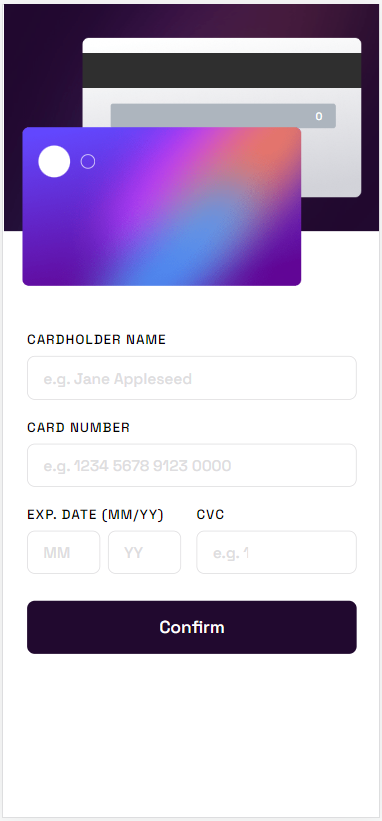
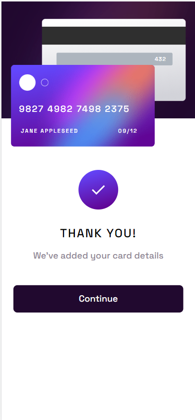
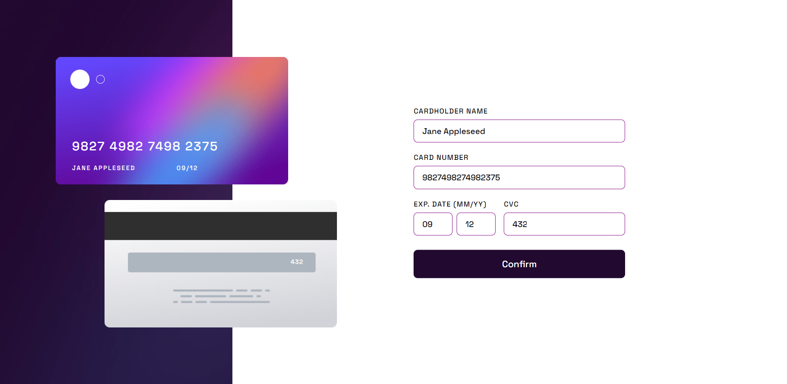

# Frontend Mentor - Interactive card details form solution

This is a solution to the [Interactive card details form challenge on Frontend Mentor](https://www.frontendmentor.io/challenges/interactive-card-details-form-XpS8cKZDWw). Frontend Mentor challenges help you improve your coding skills by building realistic projects.

## Table of contents

- [Overview](#overview)
  - [The challenge](#the-challenge)
  - [Screenshots](#screenshot)
  - [Links](#links)
- [My process](#my-process)
  - [Built with](#built-with)
  - [Useful resources](#useful-resources)
- [Author](#author)

## Overview

### The challenge

Users should be able to:

- Fill in the form and see the card details update in real-time
- Receive error messages when the form is submitted if:
  - Any input field is empty
  - The card number, expiry date, or CVC fields are in the wrong format
- View the optimal layout depending on their device's screen size
- See hover, active, and focus states for interactive elements on the page

### Screenshots

### Links

- Solution URL: [https://github.com/pedrommb7/interactive-card-details-form](https://github.com/pedrommb7/interactive-card-details-form)
- Live Site URL: [Add live site URL here](https://your-live-site-url.com)

## My process

### Built with

- HTML5
- SCSS, BEM
- Flexbox
- Atomic design
- Mobile-first workflow
- [React-TypeScript](https://create-react-app.dev/docs/adding-typescript/)

### Useful resources

- ChatGPT was used to learn and clarify doubts during the process of building this project.

## Author

- Frontend Mentor - [@pedrommb7](https://www.frontendmentor.io/profile/pedrommb7)
